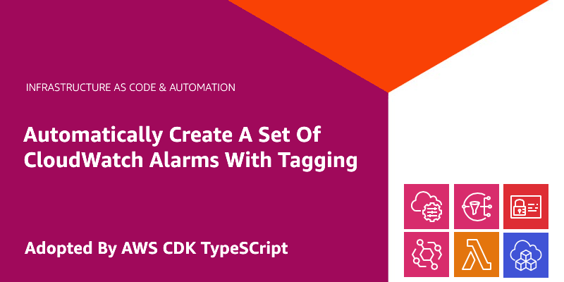

  

<h1 align="center">
  
<b>CDK CloudWatch Auto Alarms</b>

</h1>

## Abstract
- For observability, Amazon CloudWatch is one of option to collect and track metrics as well as provide alert based on the metric threadholds setting. Especially when you don't want to use external monitoring and observability tools such as datadog or prometheus, and don't want to pay extra cost for data transfering out.
- The thing is that we need an automation way of setting up CloudWatch Alarms for EC2 instances and customize the metrics as well as alert. Especially when there are new EC2 created by autoscaling or on-demand, we need to trigger the automation process to install cloudwatch agent on the EC2 instances as well as setup the alarm for them such as CPU utilization, disk I/O, and memory usage.
- In this blog post, I demonstrate how to automate the setup and configuration of CloudWatch alarms on Amazon EC2 in addition to provide alert notification to Slack channel.

## Table Of Contents
 * [Solution overview](#Solution-overview)
 * [Flow overview](#Flow-overview)
 * [Deploying the solution](#Deploying-the-solution)
 * [Test alarms](#Test-alarms)
 * [Cleanup](#Cleanup)
 * [Conclusion](#Conclusion)

---

## 🚀 **Solution overview** 

- The **CloudWatch Auto Alarms** and **Install CloudWatch Agent** AWS Lambda functions help to quickly and automatically create a standard set of CloudWatch alarms for the new Amazon EC2 instances (or just reboot the EC2 for generating Running event state). It saves the time for intalling cloudwatch agent as well as agent configuration setup, deploying alarms and setup metric alerts, plus reduces the skills gap required in order to create and manage alarms.

- This blog post gives an example of setting default configuration and createing alarms for the Amazon EC2 with Amazon Linux AMI (but the lambda function supports multiple OS such as Ubuntu, Redhat, SUSE and Windows):
  - CPU Utilization
  - Disk Space Used
  - Memory Used

- [CloudWatch agent predefined metric sets](https://docs.aws.amazon.com/AmazonCloudWatch/latest/monitoring/create-cloudwatch-agent-configuration-file-wizard.html) - Advanced
  - CPU: cpu_usage_idle, cpu_usage_iowait, cpu_usage_user, cpu_usage_system
  - Disk: disk_used_percent, disk_inodes_free
  - Diskio: diskio_io_time, diskio_write_bytes, diskio_read_bytes, diskio_writes, diskio_reads
  - Mem: mem_used_percent
  - Netstat: netstat_tcp_established, netstat_tcp_time_wait
  - Swap: swap_used_percent

- The created alarms take action of notifying an Amazon SNS topic. The SNS topic is subscribed by the AWS ChatBot associate with Slack channel to send alert message directly to Slack.

## 🚀 **Flow overview** 
- **Prerequisites:** EC2 instance use AMI versions which support automatically installing SSM agent from startup.
- In the flow chart above, it performs following steps
  1. For any EC2 instance launched or restarted, the eventbridge rule `install-cw-agent-install-cw-agent` and `cw-auto-alarm` catch the event of new Running state from the EC2 instance and then trigger their targets here are lambda functions
  2. The lambda function `install-cw-agent-install-cw-agent` does following steps
     1. Get instance tag to check if it contains tag-key `Create_Auto_Alarms` (reference to `ALARM_TAG` environment of the lambda) then proceed, otherwise, ignore
     2. Run the SSM documents `AWS-ConfigureAWSPackage` to install cloudwatch agent on the target instance and then run SSM `AWS-RunShellScript` to load cloudwatch agent config from SSM parameter store and start cloudwatch agent service
  3. The lambda function `cw-auto-alarm` based on EC2 instance tags to create cloudwatch alarms with format `AutoAlarm-<InstanceID>-<cw-namespace>-<MetricName>-<ComparisonOperator>-<Period>-<EvaluationPeriods>-<Statistic>-<CloudWatchAutoAlarms>`. These alarms send alert to the SNS topic which is defined in `DEFAULT_ALARM_SNS_TOPIC_ARN` environment
  4. When the SNS topic receive message, it forwards to AWS ChatBot webhook and then the chatbot send alert message to registered slack channel.
  5. If there's any instance terminated, the eventbridge rule `cw-auto-alarm` catch the event and then trigger lambda function to delete the alarms according to the terminated instaces

## 🚀 **Deploying the solution** 
- For infrastructure as code, in this blog post I use CDK Typescript.
- Stack visualize chart

  

- Prerequisites:
  - Add `AWS Chatbot` app to slack channel.
  - Provide slack workspace ID and slack channel ID to the CDK code.

- Deploy cdk stacks `cdk deploy --all`

## 🚀 **Test alarms** 
- The above `cdk deploy --all` includes creating EC2 instance but it might be a gap for eventbridge rule to catch event of Running state change, so for sure, just restart the EC2.
- Create one more instance to test creating alarms for new instance launch through the stack `test-ec2`
- EC2 with proper tags

  

  will be created according alarms

  

- Now we access to a EC2 using SSM connect and run [`cpu-dump.py`](https://github.com/vumdao/cdk-cloudwatch-auto-alarms/blob/master/test-alarm/cpu-dump.py) and [`test-mem-alert.py`](https://github.com/vumdao/cdk-cloudwatch-auto-alarms/blob/master/test-alarm/test-mem-alert.py) test scripts. We will see the alert then.

  - In-alarm threadhold

  

  - Slack alert

  

## 🚀 **Cleanup** 
- Destroy all the stacks within this project by running `cdk destroy --all`
- Cloudwatch logs groups which are created by Lambda functions are not parts of the project stacks so they are not deleted. Although the log group have retention but you might want to delete them for cleaning up completely

## 🚀 **Conclusion** 
- In this post, I leverage the serverless services such lambda function, eventbridge rule, systems manager, and SNS to provide automation way of creating CloudWatch alarms and alert for Amazon EC2 instances in an AWS account.
- By using SSM agent from Systems manager, the lambda function can remotely install cloudwatch agent in the EC2 instances for collecting system logs and metrics, and then create cloudwatch alarms properly based on the tags of EC2.
- The solution is deployed using AWS CDK typescript. For production, I encourage to create the CDK pipeline to deploy the IaC through codepipeline completely.

---

References:
- [Automating Amazon CloudWatch Alarms with AWS Systems Manager](https://aws.amazon.com/blogs/mt/automating-amazon-cloudwatch-alarms-with-aws-systems-manager/)
- [CloudWatchAutoAlarms - Automatically create a set of CloudWatch alarms with tagging](https://github.com/aws-samples/amazon-cloudwatch-auto-alarms)
- Open issue: [disk_used_percent does not work with device name xvda1 in Amazon Linux AMI](https://github.com/aws-samples/amazon-cloudwatch-auto-alarms/issues/43)

---

<h3 align="center">
  <a href="https://dev.to/vumdao">:stars: Blog</a>
   · 
  <a href="https://github.com/vumdao/cdk-cloudwatch-auto-alarms/">Github</a>
   · 
  <a href="https://stackoverflow.com/users/11430272/vumdao">stackoverflow</a>
   · 
  <a href="https://www.linkedin.com/in/vu-dao-9280ab43/">Linkedin</a>
   · 
  <a href="https://www.linkedin.com/groups/12488649/">Group</a>
   · 
  <a href="https://www.facebook.com/CloudOpz-104917804863956">Page</a>
   · 
  <a href="https://twitter.com/VuDao81124667">Twitter :stars:</a>
</h3>